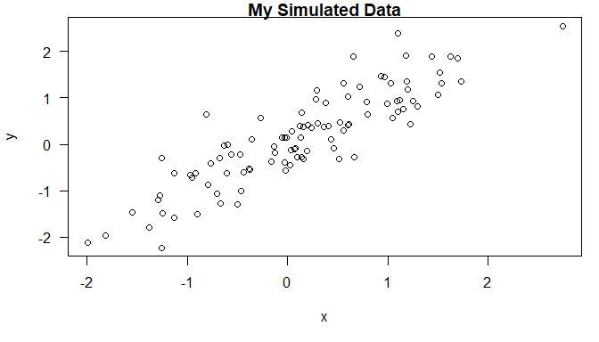

# Markdown

Markdown is a text-to-HTML tool for web writers.  

* Allows you to write in plain text format that is easy to read and write
* then converts to srtucturally valid XHTML (or HTML)  

It is a simplified version of a "markup" language that allows the writer to 
focus on writing and not formatting. It is then easily converted into HTML and other formats
    
*This text is in Italics*  
**this text is Bold**  
~~This text is crossed out~~

- list item 1
- list item 2

## Insert links with format "[Text]\(url)"
[My GitHub](https://github.com/vanbibn/IntroR-course)  
[My Blog](https://r-youready.blogspot.com/2020/04/assignment-12.html)
  
  
    

### Alternatively, for a more readable format links can be done like this:
###### Note: I'm not sure if this is still a valid way to do hyperlinks... or I'm just doing it wrong.

A book on Data Science I want to read is  [R for Data Science][1] by Hadley Wickham and Garrett Grolemund. There is also [Introduction to Data Science][2] by Rafael Irizarry. Jenny Bryan has a book on using version control called [Happy Git and GitHub for the useR][3]

This format makes your document cleaner and easier to read.

Then, at the bottom of the page put the actual urls.
[1]:https://r4ds.had.co.nz/index.html "R for Data Science"
[2]:https://rafalab.github.io/dsbook/ "Introduction to Data Science"
[3]:https://happygitwithr.com/index.html "Happy Git and GitHub for the useR"

  
  

## New lines require a double space at the end of a line  
Is this text all -
on one line?

This text sould be  
On 2 lines!
  
  
***

# R Markdown

R Mrakdown allows for integration of R code

* R code is evalusted as part of the processing of the markdown
* Results from R code are also inserted into the document
    
## In line Text computations


The current time is Sat Apr 11, 2020 11:37:21 PM.  
My favorite random number is 0.3896945.

### Incorporate graphics

First I need to simulate data.

```r
x <- rnorm(100)
y <- x + rnorm(100, sd = 0.5)
```

Then I can create a scatterplot of the data.

```r
par(mar = c(5,4,1,1), las = 1)
plot(x, y, main = "My Simulated Data")
```

<!-- -->
